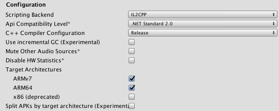
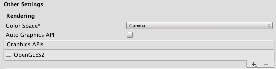
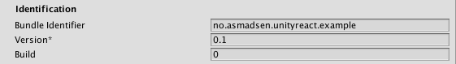
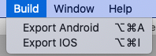

# react-native-unity-view

Integrate unity3d within a React Native app. Add a react native component to show unity. Works on both iOS and Android.

## Notice

This is a fork of [https://github.com/f111fei/react-native-unity-view](https://github.com/f111fei/react-native-unity-view)
to make it work with the newest Unity version (2019.2.9f1) and React Native >= 0.60.

**This project may or may not be updated depending on the further use of it at my workplace, however feel free to fork it** 

## Install

`yarn add react-native-unity-view`

## Configuration

Since this project uses the exported data from Unity you will have do some extra configuring than a normal React Native module.

### Configuring Unity

To configure Unity to add the exported files somewhere accessible to your app we use some build scripts. And the default
configuration expects that you place your Unity Project in the following position relative to our app.

```
.
├── android
├── ios
├── unity
│   └── <Your Unity Project>    // Example: Cube
├── node_modules
├── package.json
└── README.md
```

#### Add Unity Build scripts

Copy [Build.cs](/template/Build.cs) and [XCodePostBuild.cs](/template/XCodePostBuild.cs) and place them in 
`unity/<Your Unity Project>/Assets/Scripts/Editor/`

*If you want to place your Unity Project somewhere else you will have to change the following paths which is relative to
the Untiy Project*

* [Line 21: Build.cs](template/Build.cs#L21)
* [Line 65: Build.cs](template/Build.cs#L65)
* [Line 56: XCodePostBuild.cs](template/XCodePostBuild.cs#L56)

#### Player Settings

1. Open your Unity Project
2. Go to Player settings (File => Build Settings => Player Settings)
3. Change `Product Name` to the name of your Xcode project. (`ios/${XcodeProjectName}.xcodeproj`)

##### Additional changes for Android Platform

Under `Other Settings` make sure `Scripting Backend` is set to `IL2CPP`, and `ARM64` is checked under `Target Architectures`.

 

##### Additional changes for iOS Platform

Under `Other Settings` make sure `Auto Graphics API` is unchecked and only `OpenGLES2` is listed under `Graphics APIs`



Make sure the `Bundle Identifier` matches the one in XCode



#### Now Unity is configured and ready

Now you can export the Unity Project using `Build => Export Android` or `Build => Export IOS`.



Then the exported artifacts will be placed in a folder called `UnityExport` inside either the `android` or the `ios` folder.

### Adding UnityMessageManager Support

Add the contents of the [Assets](template/Assets) folder, to your Unity project.

*You will have to rebuild for changes to appear in React Native.* 

### Configure Native Build

#### Android Build

To allow for the project to recognize the `UnityExport` folder you will have to add two lines to `android/settings.gradle`.

```
include ":UnityExport"
project(":UnityExport").projectDir = file("./UnityExport")
```

##### After Unity Export

Node: After each Unity Export to Android you will have to delete the following from the bottom of the `android/UnityExport/build.gralde`

```
    bundle {
        language {
            enableSplit = false
        }
        density {
            enableSplit = false
        }
        abi {
            enableSplit = true
        }
    }
```

#### iOS build

Modify `main.m`

```objectivec
#import "UnityUtils.h"

int main(int argc, char * argv[]) {
  @autoreleasepool {
    InitArgs(argc, argv);
    return UIApplicationMain(argc, argv, nil, NSStringFromClass([AppDelegate class]));
  }
}
```

## Use in React Native

### UnityView Props

#### `onMessage`

Receive message from Unity

*Make sure you have added [UnityMessageManager](#adding-unitymessagemanager-support)*

##### Example:

1. Send message from Unity
```C#
UnityMessageManager.Instance.SendMessageToRN("click");
```

2. Receive message in React Native
```javascript
onMessage(event) {
    console.log('OnUnityMessage: ' + event.nativeEvent.message);    // OnUnityMessage: click
}

render() {
    return (
        <View style={[styles.container]}>
            <UnityView
                style={style.unity}
                onMessage={this.onMessage.bind(this)}
            />
        </View>
    );
}
```

#### `onUnityMessage`

[**Recommended**]Receive json message from unity.

```
onUnityMessage(handler) {
    console.log(handler.name); // the message name
    console.log(handler.data); // the message data
    setTimeout(() => {
      // You can also create a callback to Unity.
      handler.send('I am callback!');
    }, 2000);
}

render() {
    return (
        <View style={[styles.container]}>
            <UnityView
                style={style.unity}
                onUnityMessage={this.onMessage.bind(this)}
            />
        </View>
    );
}
```

### UnityModule

```
import { UnityModule } from 'react-native-unity-view';
```

#### `isReady(): Promise<boolean>`

Return whether is unity ready.

#### `createUnity(): Promise<boolean>`

Manual init the Unity. Usually Unity is auto created when the first view is added.

#### `postMessage(gameObject: string, methodName: string, message: string)`

Send message to unity.

* `gameObject` The Name of GameObject. Also can be a path string.
* `methodName` Method name in GameObject instance.
* `message` The message will post.

Example:

1. Add a message handle method in `MonoBehaviour`.

```C#
public class Rotate : MonoBehaviour {
    void handleMessage(string message) {
		Debug.Log("onMessage:" + message);
	}
}
```

2. Add Unity component to a GameObject.

3. Send message use javascript.

```javascript
onToggleRotate() {
    if (this.unity) {
      // gameobject param also can be 'Cube'.
      UnityModule.postMessage('GameObject/Cube', 'toggleRotate', 'message');
    }
}

render() {
    return (
        <View style={[styles.container]}>
            <UnityView
                ref={(ref) => this.unity = ref}
                style={style.unity}
            />
            <Button label="Toggle Rotate" onPress={this.onToggleRotate.bind(this)} />
        </View>
    );
}

```

#### `postMessageToUnityManager(message: string | UnityViewMessage)`

Send message to `UnityMessageManager`.

Please copy [`UnityMessageManager.cs`](https://github.com/f111fei/react-native-unity-demo/blob/master/unity/Cube/Assets/Scripts/UnityMessageManager.cs) to your unity project and rebuild first.

Same to `postMessage('UnityMessageManager', 'onMessage', message)`

This is recommended to use.

* `message` The message will post.

Example:

1. Add a message handle method in C#.

```javascript
void Awake()
{
    UnityMessageManager.Instance.OnMessage += toggleRotate;
}

void onDestroy()
{
    UnityMessageManager.Instance.OnMessage -= toggleRotate;
}

void toggleRotate(string message)
{
    Debug.Log("onMessage:" + message);
    canRotate = !canRotate;
}
```

2. Send message use javascript.

```
onToggleRotate() {
    UnityModule.postMessageToUnityManager('message');
}

render() {
    return (
        <View style={[styles.container]}>
            <UnityView
                ref={(ref) => this.unity = ref}
                style={style.unity}
            />
            <Button label="Toggle Rotate" onPress={this.onToggleRotate.bind(this)} />
        </View>
    );
}
```

#### `addMessageListener(listener: (message: string | MessageHandler) => void): number`

Receive string and json message from unity.

#### `addStringMessageListener(listener: (message: string) => void): number`

Only receive string message from unity.

#### `addUnityMessageListener(listener: (handler: MessageHandler) => void): number`

Only receive json message from unity.

#### `pause()`

Pause the unity player.

#### `resume()`

Resume the unity player.


### Example Code

```
import React from 'react';
import { StyleSheet, Image, View, Dimensions } from 'react-native';
import UnityView from 'react-native-unity-view';

export default class App extends React.Component<Props, State> {
    render() {
    return (
      <View style={styles.container}>
        <UnityView style={{ position: 'absolute', left: 0, right: 0, top: 0, bottom: 0, }} /> : null}
        <Text style={styles.welcome}>
          Welcome to React Native!
        </Text>
      </View>
    );
  }
}
```
